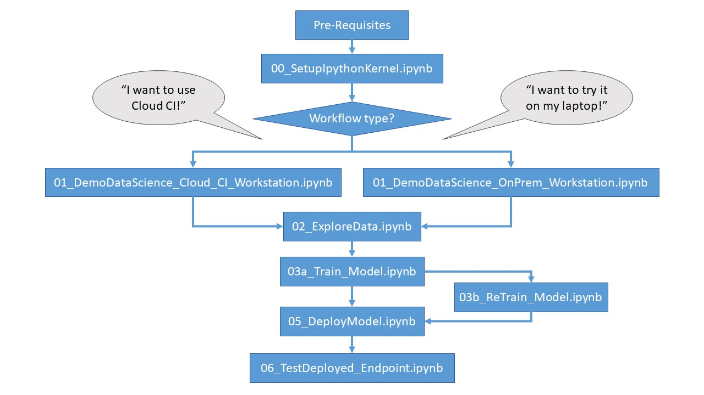

# This is AI GBB Workshop/Bootcamp for Azure Machine Learning v2

This tutorial is an introduction to some of the most used features of the Azure Machine Learning service.  In it, you will create, register and deploy a model. This tutorial will help you become familiar with the core concepts of Azure Machine Learning and their most common usage. 

You'll learn how to run a training job on a scalable compute resource or local on premise machine,create a machine learning pipeline, we will show you how to then deploy the created model, and finally test the deployment.

You'll create a training script to handle the data preparation, train and register a model. Once you train the model, you'll *deploy* it as an *endpoint*, then call the endpoint for *inferencing*.

The steps you'll take are:

> * Set up a handle to your Azure Machine Learning workspace 
> * Create your training script
> * Create a scalable compute resource, a compute cluster 
> * Create and start a training job using a remote compute cluster configured with the appropriate job environment
> * View the output of your training job
> * Deploy the newly-trained model as an endpoint
> * Call the Azure Machine Learning endpoint for inferencing

We will follow the Enterprise Machine Learning Lifecycle Patterns for onborading classical machine learning scenario on tabular data in AML Platform:

### Inner loop - Proof of concept / Model development

The inner loop element consists of your iterative Data Science workflow executed within a dedicated, secure Machine Learning workspace. A typical workflow is illustrated in the diagram below. It proceeds from data ingestion, exploratory data analysis, experimentation, model development and evaluation, to registration of a candidate model for production. This modular element as implemented in the MLOps v2 accelerator is agnostic and adaptable to the process your data science team uses to develop models.

### Middle loop - Scaled model training

Data science team will take advantage of hyperscale compute cluster to scale their model training.  The best models will be registered in AML model registry. After the data science team develops a model that's a candidate for deploying to production, the model can be registered in the Azure Machine Learning workspace registry. CI pipelines that are triggered, either automatically by model registration or by gated human-in-the-loop approval, promote the model and any other model dependencies to the model deployment phase.

### Outer loop - Model deployment 

The model deployment or outer loop phase consists of pre-production staging and testing, production deployment, and monitoring of model, data, and infrastructure. CD pipelines manage the promotion of the model and related assets through production, monitoring, and potential retraining, as criteria that are appropriate to your organization and use case are satisfied.

## Pre-requisites for Workshop Steps: 

### Step 0: Completion Pre-requisites.
https://learn.microsoft.com/en-us/azure/machine-learning/quickstart-create-resources?view=azureml-api-2

### Step 1: Setup Ipython Kernel
Open run all cells in the Get Started start with Workshop [00_SetupIpythonKernel.ipynb](00_SetupIpythonKernel.ipynb) notebook. 

### Step 2: Determine workflow type
Azure Machine Learning workflow may be initiated via Cloud CI or by using Azure CLI tools in local Windows environment.  Please determine whether Cloud CI or local command line interface would best suite your needs. Than choose the appropriate track you want to run. You can run 1, 2 or all 3 tracks. If you are new we recommend you start with Track 1: AML Python Notebooks using SDK and then move to Track 2: Use AML CLI and YAML to run ML workflow. The CLI notebooks end _CLI.ipynb.

## AI/ML Workshops

This workshop repository is comprized of a number of 3 Tracks. You can choose a path of running the notebooks using AML Python SDK or CLI or MlOps. The CLI notebooks end _CLI.ipynb.   Notebooks are organized as follows: 

### Track 1: AML Python Notebooks using SDK

### Track 2: Use AML CLI and YAML to run ML workflow. The CLI notebooks end _CLI.ipynb

Start with [02_UploadData_CLI.ipynb](02_UploadData_CLI.ipynb) if you have not run track 1. If you did you can jump straight to [03a_Train_Model_CLI.ipynb](03a_Train_Model_CLI.ipynb)

### Track 3: Use MLOps to run ML workflow. The MLOps github actions are stored in .github/workflows folder and use yaml files stored in dependencies folder.

Documentation for MLOps is coming soon...

